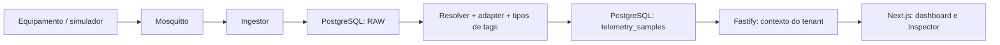

# Everlenz IIoT

Plataforma de monitoramento industrial: MQTT → Mosquitto no Coolify → captura RAW → adapter → **Supabase PostgreSQL via pg** → Fastify → Next.js. Sem comandos para CLP/IHM.

**Arquitetura atual:** VPS/Coolify existente para Mosquitto, ingestor, API e web; Supabase existente como banco definitivo. PostgreSQL Docker é um laboratório opcional. Não existe banco nem simulador no Compose de produção. Deployment real aguarda os dados listados no [handoff Coolify](docs/deployment/coolify.md). Consulte [PROJECT_STATUS.md](PROJECT_STATUS.md) para os resultados e limites da validação.

O produto inclui login seguro, usuários vinculados a equipamentos, painel configurável, descoberta automática de variáveis, cadastro guiado de dispositivos, modo TV, white label e exportação CSV/JSON/PDF. Veja a [visão da plataforma industrial](docs/product/industrial-platform.md) e o [modelo de acesso](docs/architecture/user-access.md).

## Produção: Coolify + Supabase

Selecione **docker-compose.production.yml** como arquivo independente no Coolify. Configure DATABASE_URL (Direct ou Session), secrets MQTT, certificados, tenant e domínios conforme [deployment](docs/deployment/coolify.md). Nenhum secret é necessário para build/testes. Não misture esse arquivo com o Compose local.

Migrations são uma etapa manual/controlada, antes de liberar o release:

```sh
pnpm db:status
pnpm db:migrate
pnpm db:status
# Seed POC somente se desejado no banco alvo:
pnpm db:seed
```

Os comandos usam DATABASE_URL e validação TLS; não há fallback para localhost. A alternativa compilada para produção está em **docker-compose.operations.yml**, sem tsx. Leia [Supabase e grants/RLS futura](docs/architecture/supabase.md) e [retenção/performance](docs/architecture/data-retention.md).

`pnpm docker:production:validate` valida o Compose com dados fictícios e confirma os quatro serviços, portas e escopo dos secrets, sem conectar ao Supabase. Requer Docker Compose; opcionalmente defina COMPOSE_BIN para um executável standalone.

Para desenvolver usando Supabase, configure DATABASE_URL em `.env`, suba somente o broker (`docker compose up -d mosquitto`) e use `pnpm dev`. Migrations/seed operam no banco dessa URL: confirme o alvo antes de executá-los. Não habilite o profile development se quiser usar exclusivamente o banco remoto.

## Pré-requisitos

- Node.js 22.16 ou superior compatível com Next.js 16.
- pnpm 10.28.2: `npm install -g pnpm@10.28.2`.
- Docker Engine/Desktop com containers Linux e Docker Compose v2 recente; no Windows, Docker Desktop com WSL2 habilitado.
- Portas locais 1883, 5432, 3000, 3001 e 3002 livres. Reserve aproximadamente 4 GB de RAM para o laboratório.

No PowerShell com scripts bloqueados, use `npm.cmd` e `pnpm.cmd`. Nesta máquina o pnpm foi instalado no workspace: `$env:PATH = "$PWD\.tools\pnpm\node_modules\.bin;$env:PATH"`. Esse diretório não faz parte do repositório.

## Laboratório opcional: tudo em Docker local

```sh
pnpm install --frozen-lockfile
pnpm env:setup --local
pnpm docker:up
pnpm simulator:haiwell
```

`env:setup` copia `.env.example` para `.env` e gera senhas aleatórias privadas. Se preferir copiar manualmente, use `cp .env.example .env` no Linux/macOS ou `Copy-Item .env.example .env` no PowerShell, seguido de `pnpm env:setup`. Um `.env` existente sem `CHANGE_ME` é preservado. **Use `pnpm env:setup`, não `pnpm setup`**, que é um comando interno do pnpm.

O comando docker:up habilita explicitamente o profile development. Nesse laboratório, o Compose sobe PostgreSQL e Mosquitto, gera o arquivo de senhas do broker, aplica migrations e seed e inicia ingestor, API e web com healthchecks. As credenciais dos serviços do broker usam os nomes `ingestor` e `simulator`, correspondentes à ACL. As senhas ficam no `.env`; os hashes ficam em volume Docker. Não versione `.env`.

Abra:

- Dashboard: <http://localhost:3000>
- Dispositivos: <http://localhost:3000/devices>
- Haiwell A7 Teste: <http://localhost:3000/devices/33333333-3333-4333-8333-333333333333>
- MQTT Inspector: <http://localhost:3000/mqtt-inspector>
- API e estado das dependências: <http://localhost:3001/health>
- Ingestor: <http://localhost:3002/health>

Execute o simulador por pelo menos 30 segundos para acumular pontos nos gráficos. `Ctrl+C` interrompe a publicação; após `DEVICE_OFFLINE_SECONDS` (30 por padrão), o dispositivo aparece offline. O estado indica **recebimento recente de mensagens**, não prova de conectividade direta com a máquina.

Para simular o formato genérico, em outro terminal:

```sh
pnpm simulator:generic
```

Opcionalmente, execute o simulador dentro do Docker:

```sh
docker compose --profile development --profile simulation up -d simulator
docker compose stop simulator
```

Ele usa Haiwell por padrão; defina `SIMULATOR_MODE=generic` no `.env` para trocar e recrie o serviço. `SIMULATOR_INTERVAL_MS` configura o intervalo. Não execute simultaneamente duas instâncias de ingestor com o mesmo Client ID.

## Desenvolvimento com Node.js local

Escolha este modo em vez de executar API/web/ingestor tanto no Docker quanto no host:

```sh
pnpm install --frozen-lockfile
pnpm env:setup --local
pnpm docker:infra
pnpm db:migrate
pnpm db:seed
pnpm dev
```

Em outro terminal, `pnpm simulator:haiwell`. Se a stack completa já estiver rodando, execute `docker compose stop web api ingestor` antes de `pnpm dev`. O comando `dev` inicia os três serviços em paralelo. As bibliotecas carregam o `.env` da raiz; o frontend usa um proxy de mesma origem e `API_INTERNAL_URL`, com padrão `http://127.0.0.1:3001`. Se alterar a porta da API no modo local, forneça `API_INTERNAL_URL` também ao processo Next.js (ou em `apps/web/.env.local`, ignorado pelo Git).

Com --local, env:setup preenche DATABASE_URL local somente quando vazia; nunca substitui uma URL remota existente. Para Supabase, mantenha apenas DATABASE_URL real nos secrets/ambiente privado.

## Comandos

| Comando                             | Efeito                                                                                          |
| ----------------------------------- | ----------------------------------------------------------------------------------------------- |
| `pnpm env:setup`                    | Prepara `.env` com credenciais aleatórias                                                       |
| `pnpm docker:up`                    | Build de imagens e stack completa; aguarda healthchecks                                         |
| `pnpm docker:infra`                 | Apenas banco, inicialização de credenciais e broker                                             |
| `pnpm db:migrate`                   | Migrations SQL versionadas, transacionais e com lock                                            |
| `pnpm db:seed`                      | Seed idempotente de desenvolvimento                                                             |
| `pnpm user:bootstrap-master`        | Cria o primeiro usuário master com senha temporária fornecida pelo ambiente                     |
| `pnpm dev`                          | API, ingestor e Next.js locais                                                                  |
| `pnpm simulator:haiwell`            | Publicador no formato experimental                                                              |
| `pnpm simulator:generic`            | Publicador JSON genérico                                                                        |
| `pnpm lint`                         | ESLint + verificação TypeScript do monorepo e frontend                                          |
| `pnpm test`                         | Testes unitários Vitest                                                                         |
| `pnpm test:integration`             | SQL real via PostgreSQL WASM/PGlite + pipeline + API                                            |
| `pnpm test:e2e`                     | Publicação nos dois formatos via broker, verificação SQL, API e rotas web; exige stack completa |
| `pnpm test:load`                    | Teste HTTP progressivo, com parada automática no limite de latência ou erros                    |
| `pnpm build`                        | Verificação/compilação dos serviços e build de produção Next.js                                 |
| `pnpm format` / `pnpm format:check` | Prettier                                                                                        |
| `pnpm docker:down`                  | Para containers preservando volumes                                                             |

O backend usa `tsx` no desenvolvimento. O build verifica os tipos e gera bundles JavaScript em `apps/{api,ingestor,simulator}/dist`, executados por Node.js nos containers. O frontend gera artefatos de produção Next.js. PGlite é somente uma dependência de teste, não substitui PostgreSQL na stack.

## Banco e seed

O seed cria o tenant **POC Industrial** (`poc`), site **Laboratório** (`laboratorio`), **Haiwell A7 Teste** e um gateway genérico. Ambos recebem `temperatura` (°C), `corrente_motor` (A), `velocidade` (%) e `status` (boolean). A Haiwell é mapeada por `POC/group1/A7-001`; o gateway usa o tópico da plataforma.

```sh
docker compose exec postgres psql -U iiot -d iiot
```

Dentro do psql:

```sql
SELECT id, topic, qos, retain, parser_used, processing_status, received_at
FROM mqtt_messages_raw ORDER BY id DESC LIMIT 10;

SELECT t.key, s.timestamp, s.value_number, s.value_boolean, s.quality
FROM telemetry_samples s JOIN tags t ON t.id=s.tag_id
ORDER BY s.id DESC LIMIT 12;
```

Se mudar usuário/banco no `.env`, ajuste o comando. Migrations e seed podem ser repetidos. O usuário master pode cadastrar equipamentos pela interface; mappings e ajustes avançados de tags continuam disponíveis por migration ou script controlado.

## Descoberta da Haiwell

Defina no `.env`:

```dotenv
MQTT_DISCOVERY_MODE=true
OPERATOR_RAW_ACCESS=true
```

Recrie os serviços: `docker compose up -d --force-recreate ingestor api`. No modo Node local, reinicie os processos. O ingestor assina `#` e preserva mensagens sem parser; o acesso operador permite ver mensagens ainda sem tenant. É uma função **local de diagnóstico**. Depois do teste, restaure ambos para `false` e mantenha somente os filtros necessários.

O guia oficial não foi usado para presumir o payload da A7. `HAIWELL_FORMAT_HYPOTHESIS` identifica o formato experimental. Leia [o que sabemos](docs/haiwell/README.md) e [o roteiro do primeiro teste real](docs/haiwell/first-real-device-test.md).

## Formato genérico

Tópico: `iiot/poc/laboratorio/generic-001/telemetry`.

```json
{
  "timestamp": "2026-09-07T12:00:00Z",
  "values": { "temperatura": 65.2, "corrente_motor": 387.4, "status": true }
}
```

O timestamp deve ser ISO 8601 com timezone; quando omitido, usa o recebimento. Não se confia em IDs de tenant enviados dentro do payload. O tópico cadastrado resolve o dispositivo; o adapter extrai valores; as tags configuradas definem tipos, escala e unidade.

## Autenticação e API

O navegador usa uma sessão aleatória em cookie HttpOnly, `SameSite=Strict`, com duração de 12 horas. A senha é armazenada somente como hash `scrypt`, e todos os usuários devem substituí-la no primeiro acesso. O papel `master` administra usuários, equipamentos, painéis e white label. O papel `user` recebe apenas os equipamentos selecionados no cadastro; a API aplica esse filtro em todas as consultas de dados. Usuários desativados perdem imediatamente as sessões abertas.

Headers e query strings não podem escolher outro tenant. As exportações e a API JSON usam a mesma autorização da sessão. Tokens de serviço para integrações automáticas ainda serão implementados.

Uma sessão também expira após 4 horas sem atividade, além do teto de 12 horas. Dez tentativas de login erradas bloqueiam a conta por 15 minutos; o bloqueio sobrevive a redeploy, e o reset de senha feito por um master desfaz o bloqueio. Login sempre responde `401` com a mesma mensagem, seja qual for o motivo, para não revelar quais contas existem.

**A senha MQTT do equipamento não é armazenada.** Ela aparece uma única vez, no cadastro do dispositivo, e depois só pode ser substituída em **Gerar nova senha MQTT** na tela do equipamento. Anote-a ao cadastrar. Toda alteração de usuário, equipamento, tag ou credencial fica registrada em `audit_log`. Consulte [SECURITY.md](SECURITY.md) para o estado completo, as pendências e as verificações que precisam rodar no servidor.

| Endpoint                      | Filtros                                                            |
| ----------------------------- | ------------------------------------------------------------------ |
| `GET /health`                 | 200 quando banco acessível; broker é diagnóstico adicional         |
| `GET /api/tenants`            | Tenant do contexto atual                                           |
| `GET /api/sites`              | `limit`, `offset`                                                  |
| `GET /api/devices`            | `limit`, `offset`                                                  |
| `GET /api/devices/:id`        | UUID; 404 se ausente no tenant                                     |
| `GET /api/devices/:id/tags`   | Tags configuradas                                                  |
| `GET /api/devices/:id/latest` | Última amostra por tag habilitada                                  |
| `GET /api/telemetry`          | `deviceId` obrigatório; `tagId`, `from`, `to`, `limit`, `offset`   |
| `GET /api/mqtt/raw`           | `topic` exato, `from`, `to`, `processingStatus`, `limit`, `offset` |
| `GET /api/mqtt/topics`        | `limit`, `offset`; contador, primeira/última ocorrência            |
| `GET /api/overview`           | Contadores e acesso operador ativo                                 |

Listagens retornam arrays. `limit` padrão 100, máximo 500; `offset` padrão 0. Datas em ISO 8601 com timezone. Telemetria retorna as mais recentes primeiro; o gráfico reordena e mostra até 500 pontos por variável no período escolhido. Não há downsampling automático: períodos longos podem mostrar apenas a parte mais recente. A API permite paginação para extrair o restante.

## Operação e diagnóstico

```sh
docker compose ps
docker compose logs --tail=100 mosquitto ingestor api
pnpm test:e2e
pnpm docker:down
```

Não use `docker compose down -v` para uma parada normal: esse comando apaga os dados persistidos. Trocar `POSTGRES_PASSWORD` após inicializar o volume não altera a senha dentro do banco: faça rotação SQL controlada. Para rotacionar as senhas de serviço MQTT, ajuste `.env`, execute `docker compose run --rm mqtt-init` e reinicie/recrie broker e clientes.

Falhas comuns: porta ocupada por serviços locais e Docker ao mesmo tempo; `.env` sem configuração; Docker Desktop parado; ACL divergente dos nomes dos usuários; filtros normais sem o tópico proprietário; device/tag desabilitados. Veja `processing_error` no Inspector. Mensagens `pending` indicam captura interrompida antes da conclusão e precisam de análise; reprocessamento automatizado fica para a próxima etapa.

## Arquitetura e segurança



Veja [arquitetura](docs/architecture/README.md), [segurança MQTT e TLS](docs/architecture/mqtt-security.md) e [status e limitações](PROJECT_STATUS.md). Portas do Compose ficam em loopback por padrão. 1883 só para desenvolvimento, LAN controlada ou VPN. O overlay `docker-compose.tls.yml` prepara 8883 com certificados fornecidos pelo operador. Não foram gerados certificados públicos nem presumido suporte TLS da A7.
